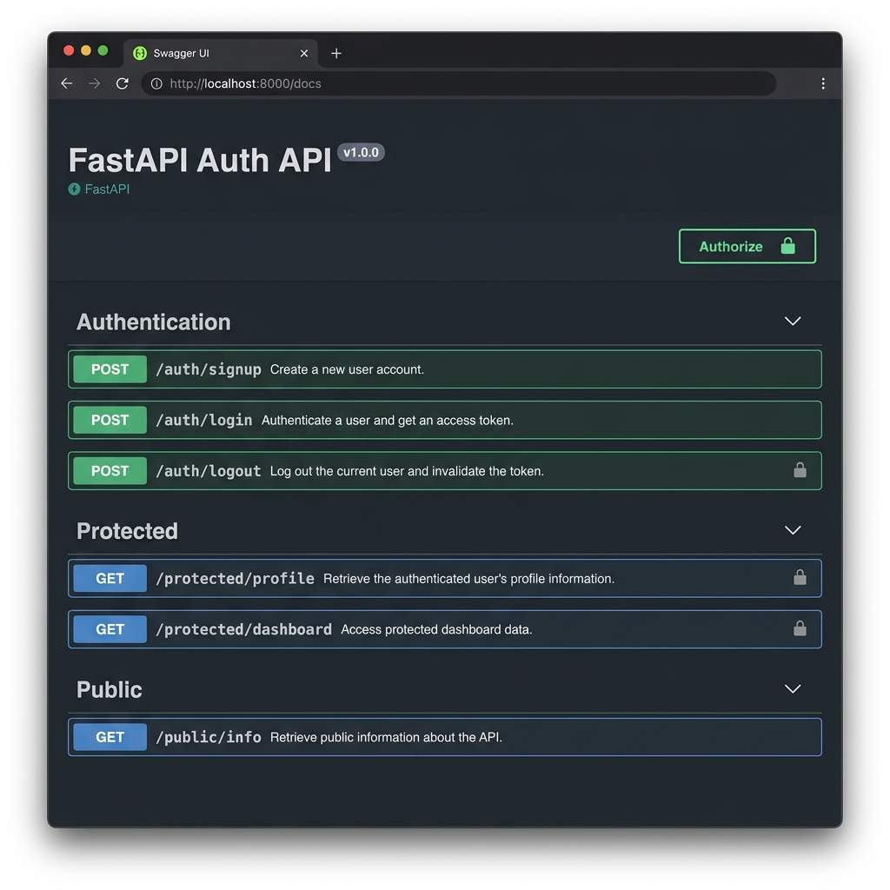

# 🛡️ FastAPI Supabase Auth API

A production-ready, secure RESTful API built with **FastAPI** and **Supabase Auth**. This API features full user authentication (Sign Up, Log In, Log Out), token-based route protection using FastAPI dependencies, interactive Swagger UI (`/docs`) with Bearer token support, and automated test coverage.

---

## 📐 Architecture & Security Model

Authentication follows the **Trust Triangle** paradigm:

1. **Sign Up & Log In**: Clients send credentials to Supabase IdP via `/auth/signup` and `/auth/login`.
2. **Token Issuance**: Supabase validates credentials and issues a cryptographically signed JSON Web Token (JWT access token).
3. **Protected Requests**: The client includes `Authorization: Bearer <JWT>` in HTTP request headers.
4. **Token Verification**: Backend FastAPI dependencies verify the JWT using `supabase.auth.get_user(token)` before granting access to protected endpoints (`/protected/profile`, `/protected/dashboard`, `/auth/logout`).

---

## 📁 Project Structure

```text
fastapi-auth-api/
│
├── app/
│   ├── __init__.py
│   ├── main.py            # FastAPI app entrypoint & exception handlers
│   ├── config.py          # Environment variable configuration
│   ├── supabase_client.py # Supabase client initialization
│   ├── auth.py            # Auth routes (/auth/signup, /auth/login, /auth/logout)
│   ├── routes.py          # Public & protected routes (/public/info, /protected/profile, /protected/dashboard)
│   ├── dependencies.py    # Reusable get_current_user JWT auth dependency
│   └── schemas.py         # Pydantic request/response data models
│
├── tests/
│   ├── __init__.py
│   └── test_api.py        # Automated test suite using TestClient & pytest
│
├── screenshots/
│   └── swagger.png        # Interactive Swagger UI with Bearer auth padlock
│
├── .env.example           # Environment variable template
├── .gitignore             # Git ignore file (prevents committing secrets like .env)
├── README.md              # Project documentation
└── requirements.txt       # Project dependencies
```

---

## ⚡ Quick Start & Setup

### 1. Clone the repository

```bash
git clone <your-repository-url>
cd fastapi-auth-api
```

### 2. Create and activate a virtual environment

```bash
# Windows
python -m venv .venv
.venv\Scripts\activate

# macOS / Linux
python3 -m venv .venv
source .venv/bin/activate
```

### 3. Install dependencies

```bash
pip install -r requirements.txt
```

### 4. Configure Environment Variables

Copy `.env.example` to `.env` and fill in your Supabase Project URL and Anon Key:

```bash
copy .env.example .env
```

```env
SUPABASE_URL=https://your-project-ref.supabase.co
SUPABASE_KEY=your-supabase-anon-key
```

### 5. Run the Server

```bash
uvicorn app.main:app --reload
```

The API server will start locally at **`http://127.0.0.1:8000`**.

---

## 🧪 Running Automated Tests

Run the complete test suite using `pytest`:

```bash
python -m pytest -v
```

---

## 📋 API Reference Table

| Method | Endpoint | Description | Auth Required | Success Status | Error Statuses |
| --- | --- | --- | --- | --- | --- |
| `GET` | `/` | Health check endpoint | No | `200 OK` | - |
| `GET` | `/public/info` | Public info accessible to everyone | No | `200 OK` | - |
| `POST` | `/auth/signup` | Register a new user account | No | `201 Created` | `400 Bad Request` |
| `POST` | `/auth/login` | Authenticate user & return JWT tokens | No | `200 OK` | `400 Bad Request`, `401 Unauthorized` |
| `POST` | `/auth/logout` | Terminate current user session | Yes (`Bearer <token>`) | `204 No Content` | `401 Unauthorized` |
| `GET` | `/protected/profile` | Read authenticated user profile details | Yes (`Bearer <token>`) | `200 OK` | `401 Unauthorized` |
| `GET` | `/protected/dashboard` | Read user dashboard data | Yes (`Bearer <token>`) | `200 OK` | `401 Unauthorized` |

---

## 📸 Interactive Swagger UI (`/docs`)

FastAPI automatically serves interactive API documentation at **`http://127.0.0.1:8000/docs`**.

1. Click the **Authorize** lock button in Swagger UI.
2. Paste your JWT access token obtained from `/auth/login`.
3. Test protected endpoints directly from your browser!



---

## 🤖 Bonus Stage 7: AI vs Me Analysis

### Comparison Overview

When comparing custom hand-crafted implementation against AI generation:

1. **Header Parsing & Bearer Prefix**:
   - *Manual / Hand-crafted*: Extracted via `HTTPBearer(auto_error=False)` or explicit string splitting (`Authorization: Bearer <token>`).
   - *AI Traps*: AI assistants often forget `auto_error=False`, resulting in default FastAPI 422 or generic 403 responses instead of the exact 401 `{"error": "Access token required"}` required by standard client specs.
2. **Error Format Consistency**:
   - *Implementation Choice*: Standardized all exception responses to top-level `{"error": "<message>"}` payloads using FastAPI custom exception handlers.
   - *AI Traps*: AI often defaults to nested `{"detail": "..."}` objects which breaks strict consumer contracts.
3. **Session Management & Logout**:
   - *Implementation Choice*: Utilized `supabase.auth.sign_out()` inside a protected route dependency ensuring session invalidation.

---

## 📄 License

MIT
